Hotel Bookings Analysis
================
Tsion Tesfaye
2020-03-26

  - [Overview](#overview)
  - [Part I: Exploratory Data Analysis
    (EDA)](#part-i-exploratory-data-analysis-eda)
      - [Wrangling](#wrangling)
          - [Cancelation trend over the
            years](#cancelation-trend-over-the-years)
          - [Cancelation vs Lead Time](#cancelation-vs-lead-time)
  - [How to make fewer breaks show up on the x
    axis?](#how-to-make-fewer-breaks-show-up-on-the-x-axis)
      - [Cancelation per arrival month](#cancelation-per-arrival-month)
      - [Cancelation per day of month](#cancelation-per-day-of-month)
      - [Cancelation vs Booking Method](#cancelation-vs-booking-method)
      - [Cancelation vs other aspects of
        booking](#cancelation-vs-other-aspects-of-booking)
  - [Part II: Modeling](#part-ii-modeling)
  - [Conclusion](#conclusion)

``` r
# Libraries
library(tidyverse)
library(lubridate)
library(tidymodels)
library(kknn)

# Parameters

  # Hotel bookings dataset
input_bookings <- 
  "/Users/tsiontesfaye/Desktop/Classes/DCL/Portfolio/data/hotel_bookings.csv"

#===============================================================================

# Code

bookings <- read_csv(input_bookings)
```

# Overview

This data set contains booking information for a city hotel and a resort
hotel, and includes information such as when the booking was made,
length of stay, the number of adults, children, and/or babies, and the
number of available parking spaces, among other things. The dataset
contains bookings due to arrive between the 1st of July of 2015 and the
31st of August 2017, including bookings that effectively arrived and
bookings that were canceled. Since this is hotel real data, all data
elements pertaining hotel or costumer identification were deleted.

The data is originally from the article Hotel Booking Demand Datasets,
written by Nuno Antonio, Ana Almeida, and Luis Nunes for Data in Brief,
Volume 22, February 2019. I obtained this data from
[kaggle.com](https://www.kaggle.com/jessemostipak/hotel-booking-demand).

We’ll first explore the variables and then proceed to formulating a
prediction model.

# Part I: Exploratory Data Analysis (EDA)

## Wrangling

``` r
glimpse(bookings)
```

This dataset contains numberous intriguing variables. For ease of use,
we’ll recode cancelations as True or False instead of 1 and 0. We’ll
also recode other logical variables.

``` r
bookings <- 
  bookings %>% 
  mutate(
    is_canceled = as.character(is_canceled),
    is_canceled = 
      recode(is_canceled, "0" = "FALSE", "1" = "TRUE", .default = NA_character_),
    arrival_date_year = as.character(arrival_date_year),
    is_repeated_guest = as.character(is_repeated_guest),
    is_repeated_guest = 
      recode(is_repeated_guest, "0" = "FALSE", "1" = "TRUE", .default = NA_character_),
    required_car_parking_spaces = as.character(required_car_parking_spaces),
    required_car_parking_spaces =
      recode(
        required_car_parking_spaces, "0" = "FALSE", "1" = "TRUE", .default = NA_character_
      )
  )
```

``` r
bookings %>% 
  count(hotel) %>% 
  mutate(n = n / sum(n) * 100) %>% 
  ggplot(aes(hotel, n, fill = hotel)) +
  geom_col() +
  scale_y_continuous(
    labels = scales::label_percent(scale = 1, accuracy = 1),
    breaks = scales::breaks_width(5)
  ) +
  scale_fill_manual(
    values = c("brown4", "blue4")
  ) +
  theme(legend.position = NULL) +
  labs(
    x = "Type of Hotel",
    y = "Percentage",
    title = "Types of Hotels",
    subtitle = "This dataset contains twice as many city hotels as resort hotels.",
    fill = "Hotel Type",
    caption = "Source: sciencedirect.com"
  )
```

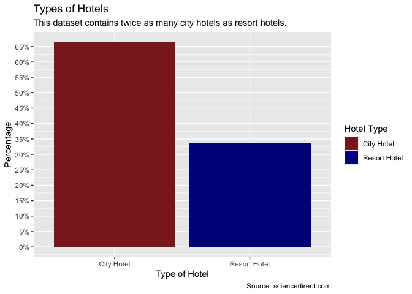<!-- -->

About 33% of this dataset are resort hotels while 67% are city hotels.
Our analysis will compare and contast the trend in these two types of
hotels.

Let’s look into cancellation per hotel type.

``` r
 bookings %>% 
  count(hotel, is_canceled, name = "prop") %>% 
  group_by(hotel) %>% 
  mutate(
    prop = round(prop / sum(prop) * 100, digits = 1)
  ) %>% 
  ungroup() %>% 
  filter(is_canceled == "TRUE") %>% 
  ggplot(aes(hotel, prop, fill = hotel)) +
  geom_col() +
  geom_label(
    aes(hotel, (prop + 2), label = prop),
    alpha = 0.5,
    color = "white",
    show.legend = FALSE
  ) +
  scale_fill_manual(
    values = c("brown4", "blue4")
  ) +
  scale_y_continuous(
    labels = scales::label_percent(scale = 1, accuracy = 0.1)
  ) +
  theme(legend.position = "none") +
  labs(
    x = NULL,
    y = "Proportion of Cancelation",
    title = "Proportion of Cancelation per Hotel Type",
    subtitle = "City Hotels experience a 41.7% cancelation",
    caption = "Source: sciencedirect.com"
  )
```

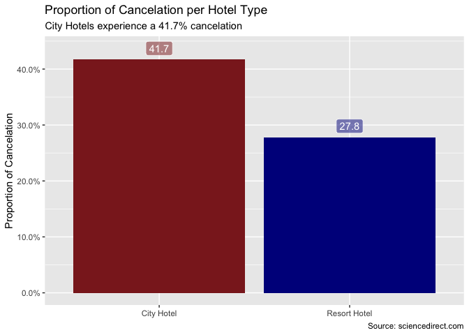<!-- -->

It is alarming that city hotels experience a `41.7%` cancelation rate
compared to only `27.8%` at resort hotels. This causes hotels to lose
`41.7%` of thier anticipated income. I am curious to see if there is a
difference in lead time, time of year, or other variables that makes a
booking more likely to be canceled.

### Cancelation trend over the years

``` r
bookings %>% 
  group_by(arrival_date_year) %>% 
  count(is_canceled, hotel) %>% 
  mutate(prop = n / sum(n)) %>% 
  filter(is_canceled == "TRUE") %>% 
  ggplot(aes(arrival_date_year, prop, color = hotel, group = hotel)) +
  geom_line() +
  geom_point() +
  scale_color_manual(
    values = c("brown4", "blue4")
  ) +
  scale_y_continuous(
    breaks = scales::breaks_width(0.05),
    labels = scales::label_percent(accuracy = 1)
  ) +
  theme(legend.position = "") +
  annotate(
    "text",
    x = c("2017", "2017"),
    y = c(0.3, 0.11),
    label = c("City Hotel", "Resort Hotel"),
    color = c("brown4", "blue4")
  ) +
  labs(
    x = NULL,
    y = "Proportion of Cancelation",
    title = "Percent of Cancelation over the Years",
    subtitle = "There is a slight increase in cancelations in 2017."
  )
```

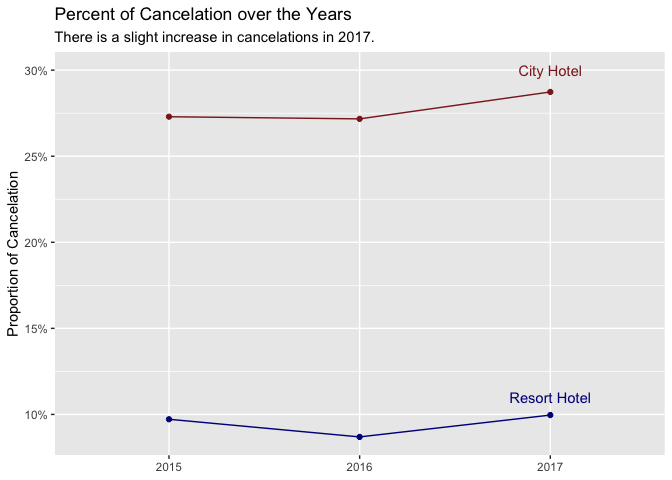<!-- -->

There is a slight increase in cancelations in 2017. This increas could
be explained by the increase in travel services such as `booking.com`
that offer free cancelations for travelers.

### Cancelation vs Lead Time

``` r
bookings %>% 
  mutate(
    lead_time = 
      cut(lead_time, breaks = 100, include.lowest = TRUE)
  ) %>% 
  group_by(lead_time) %>% 
  count(is_canceled, hotel) %>% 
  mutate(prop = n / sum(n)) %>% 
  filter(is_canceled == "TRUE") %>% 
  ggplot(aes(lead_time, prop, color = hotel, group = hotel)) +
  geom_point(size = 1, alpha = 0.5) +
  geom_smooth(method = 'loess') +
  scale_color_manual(
    values = c("brown4", "blue4")
  ) +
  scale_x_discrete(
    breaks = list(59, 133, 206)
    # labels = c("0", "1", "200")
    #name = "x"
  ) +
  scale_y_continuous(
    breaks = scales::breaks_width(0.1),
    labels = scales::label_percent(accuracy = 1),
    limits = c(0, 1)
  ) +
  theme(
    axis.text.x = element_text(angle = 45),
    legend.position = ""
  ) +
  annotate(
    "text",
    x = c(79, 70),
    y = c(0.8, 0.08),
    label = c("City Hotel", "Resort Hotel"),
    color = c("brown4", "blue4")
  ) +
  labs(
    x = NULL,
    y = "Proportion of Cancelation",
    title = "Rate of Cancelation vs Lead Time",
    subtitle = "The longer the lead time, the higher the probability that the booking will be canceled."
  )
```

    ## `geom_smooth()` using formula 'y ~ x'

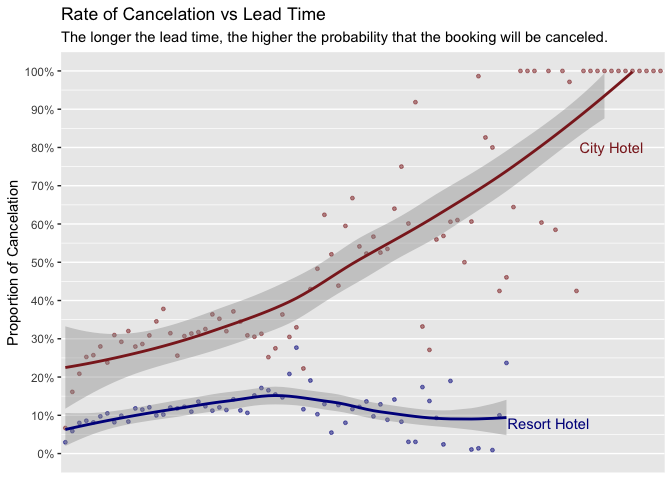<!-- -->

# How to make fewer breaks show up on the x axis?

This plot shows that there is a strong linear relationship between lead
time (the number of days between date of booking and expected date of
arrival). If the lead time is greater than 700 days, it is almost 100%
certain that the booking will be canceled.

### Cancelation per arrival month

``` r
bookings %>% 
  mutate(arrival_date_month = match(bookings$arrival_date_month, month.name)) %>% 
  count(hotel, is_canceled, arrival_date_month) %>% 
  group_by(arrival_date_month) %>% 
  mutate(n = n / sum(n)) %>% 
  filter(is_canceled == "TRUE") %>% 
  ggplot(aes(arrival_date_month, n, color = hotel, group = hotel)) +
  geom_line() +
  geom_point(size = 0.6) +
  scale_x_continuous(
    breaks = scales::breaks_width(1)
  ) +
  scale_y_continuous(
    labels = scales::label_percent(accuracy = 1)
  ) +
  scale_color_manual(
    values = c("brown4", "blue4")
  ) +
  theme(legend.position = "bottom") +
  annotate(
    "label",
    x = 5,
    y = 0.25,
    label = "←  Apr - Jun  →\nHigh Cancelation Period",
    size = 2.4,
    color = "red",
    alpha = 0.5
  ) +
  labs(
    x = "Months of The Year",
    y = "Proportion of Cancelation",
    title = "Rate of Cancelation During Months of The Year",
    color = NULL
  )
```

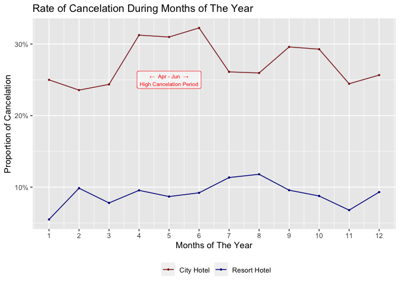<!-- -->

Both city hotels and resorts follow a similar cancelation trend during
the duration of a year. Nov - Feb are the lowest canceling months.
However, cancelation rate doubles in the months of Apr - June, Aug, and
Oct for city hotels while it peaks in August for resort hotels.

### Cancelation per day of month

``` r
bookings %>% 
  count(hotel, is_canceled, arrival_date_day_of_month) %>% 
  group_by(arrival_date_day_of_month) %>% 
  mutate(n = n / sum(n)) %>% 
  filter(is_canceled == "TRUE") %>%
  ggplot(aes(arrival_date_day_of_month, n, color = hotel)) +
  geom_point(size = 0.6) +
  geom_line() +
  scale_x_continuous(
    breaks = scales::breaks_width(1)
  ) +
  scale_y_continuous(
    labels = scales::label_percent(accuracy = 0.1)
  ) +
  scale_color_manual(
    values = c("brown4", "blue4")
  ) +
  theme(legend.position = "bottom") +
  labs(
    x = "Anticipated Arrival Day of The Month",
    y = "Proportion of Cancelation",
    title = "Rate of Cancelation during Days of The Month",
    subtitle = "Rate of cancelation is highest mid month (15th - 17th)",
    color = NULL
  )
```

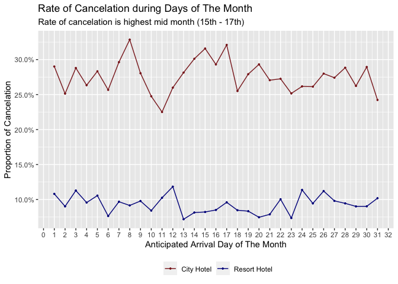<!-- -->

Compared to the previous plots, this one indicates that day of the month
has less impact than lead time and month of the year since the range of
probability of cancelation is less than 9% for city hotel and even lower
for resort hotels. However, the day of the month still has slight
influence on probability of cancelation. The plot shows that days 15-17
are most prone to cancelation for both city and resort hotels while days
8 - 11 are least likely to cancelations.

### Cancelation vs Booking Method

``` r
bookings %>% 
  count(hotel, is_canceled, distribution_channel) %>% 
  group_by(is_canceled) %>% 
  mutate(n = n / sum(n)) %>% 
  filter(
    is_canceled == "TRUE"
  ) %>% 
  ggplot(aes(distribution_channel, n, color = hotel, group = hotel)) +
  geom_point() +
  geom_line() +
  geom_hline(yintercept = 0.417, color = "brown4", size = 0.2) +
  scale_y_continuous(
    labels = scales::label_percent(accuracy = 1),
    breaks = scales::breaks_width(0.1)
  ) +
  scale_color_manual(
    values = c("brown4", "blue4")
  ) +
  theme(legend.position = "bottom") +
  annotate(
    "text",
    x = "Undefined",
    y = 0.44,
    label = "Median (City Hotel)",
    color = "brown4",
    size = 3
  ) +
  labs(
    x = "Method of Booking",
    y = "Proportion of Cancelation",
    color = NULL,
    title = "Rate of Cancelation per Method of Booking",
    subtitle = "Most cancelations were booked by Travel Agents and/or Tour Opearators"
  )
```

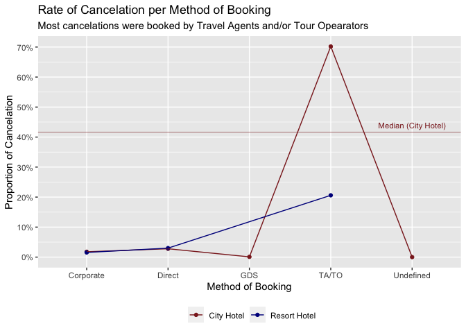<!-- -->

The rate of cancelation when booked as part of a corporate or directly
is minimal both for city and resort hotels. Note that there are no
Global Distribution System (GDS) bookings for resorts. The cancelation
rate is maximum (70%) when booked by a Travel Agent (TA) or Tour
Operators (TO). This is an important insight for hotel managers\!

``` r
bookings %>% 
  count(hotel, is_canceled, deposit_type) %>% 
  group_by(is_canceled) %>% 
  mutate(n = n / sum(n)) %>% 
  filter(is_canceled == "TRUE") %>% 
  ggplot(
    aes(fct_reorder(deposit_type, n, .desc = TRUE), n, fill = hotel, group = hotel)
  ) +
  geom_col(position = "dodge") +
  scale_y_continuous(
    labels = scales::label_percent(accuracy = 1),
    breaks = scales::breaks_width(0.15)
  ) +
  scale_fill_manual(
    values = c("brown4", "blue4")
  ) +
  theme(legend.position = "bottom") +
  labs(
    x = NULL,
    y = "Proportion of Cancelation",
    title = "Rate of Cancelation per Deposit Type",
    subtitle = 
      "As expected, bookings without a deposit are twice as likely to get canceled.",
    fill = NULL
  )
```

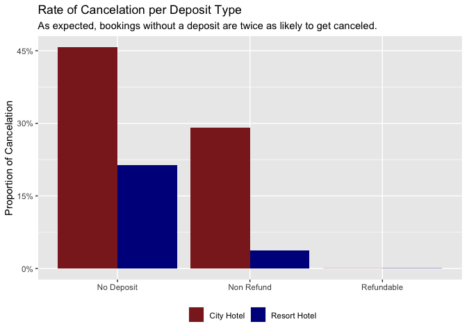<!-- -->

According to the documentation for this dataset, `Non Refund` indicates
those where a deposit was made in the value of the total stay cost while
`Refundable` refers to deposits made with a value under the total cost
of stay. As expected, 45% of the cancelations in city hotels come from
no-deposit bookings.

### Cancelation vs other aspects of booking

``` r
bookings %>% 
  count(hotel, is_canceled, booking_changes) %>% 
  filter(is_canceled == "TRUE") %>% 
  ggplot(aes(booking_changes, n, color = hotel)) +
  geom_point(size = 0.7) +
  geom_line() +
  geom_vline(xintercept = median(bookings$booking_changes), color = "red") +
  scale_color_manual(
    values = c("brown4", "blue4")
  ) +
  annotate(
    "text",
    x = 2.1,
    y = 35500,
    label = "Median Interaction = 0",
    color = "red",
    size = 3
  ) +
  theme(legend.position = "bottom") +
  labs(
    x = "Number of changes/amendments made to the booking",
    y = "Number of Cancelations",
    title = "Cancelation vs Number of Changes",
    subtitle = 
      "The more changes a customer makes, the less likely they are to cancel the booking",
    color = NULL
  )
```

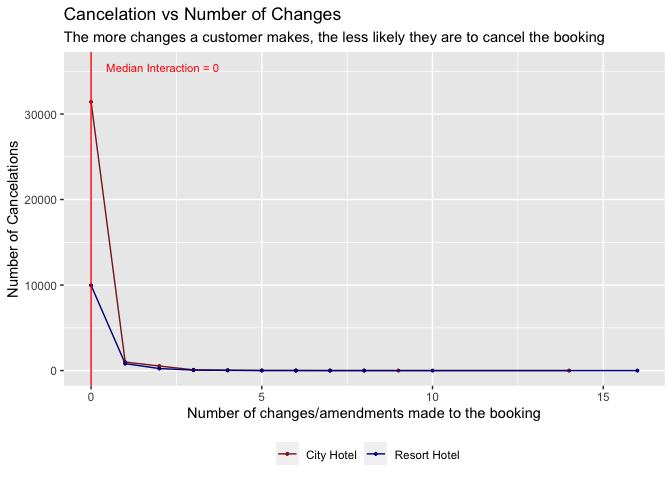<!-- -->

This plot shows an important insight that the more changes a customer
makes to a booking, the less likely they are to cancel it.
Unfortunately, the median number of changes is 0. If hotel managers
could devote more resources to contacting the customers, they might
decrease the number of cancelations.

``` r
bookings %>% 
  count(hotel, is_canceled, is_repeated_guest)
```

    ## # A tibble: 8 x 4
    ##   hotel        is_canceled is_repeated_guest     n
    ##   <chr>        <chr>       <chr>             <int>
    ## 1 City Hotel   FALSE       FALSE             44637
    ## 2 City Hotel   FALSE       TRUE               1591
    ## 3 City Hotel   TRUE        FALSE             32661
    ## 4 City Hotel   TRUE        TRUE                441
    ## 5 Resort Hotel FALSE       FALSE             27271
    ## 6 Resort Hotel FALSE       TRUE               1667
    ## 7 Resort Hotel TRUE        FALSE             11011
    ## 8 Resort Hotel TRUE        TRUE                111

As expected, repeated guests are less likely to cancel.

``` r
bookings %>% 
  count(hotel, is_canceled, adults) %>% 
  filter(is_canceled == "TRUE") %>% 
  ggplot(aes(adults, n, color = hotel)) +
  geom_point(alpha = 0.5, size = 1) +
  geom_line() +
  scale_x_continuous(
    breaks = seq(0, 10, 2)
  ) +
  scale_color_manual(
    values = c("brown4", "blue4")
  ) +
  theme(legend.position = "bottom") +
  labs(
    x = "Number of Adults Booking",
    y = "Number of Cancelations",
    title = "Cancelation Rate per Number of Booking Adults",
    subtitle = "Bookings for 2 have the highest level of cancelation"
  )
```

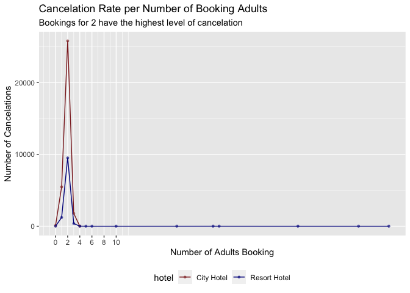<!-- -->

Bookings for 2 adults have the highest level of cancelation.

``` r
bookings %>% 
  count(is_canceled, previous_cancellations, hotel) %>% 
  group_by(previous_cancellations) %>% 
  mutate(n = n / sum(n)) %>% 
  filter(is_canceled == "TRUE") %>% 
  ggplot(aes(previous_cancellations, n, color = hotel)) +
  geom_point() +
  geom_line() +
  scale_x_continuous(
    breaks = scales::breaks_width(1)
  ) +
  scale_y_continuous(labels = scales::label_percent(accuracy = 1)) +
  scale_color_manual(
    values = c("brown4", "blue4")
  ) +
  labs(
    x = "Number of Previous Cancelations",
    y = "Proportion of Cancelation",
    title = "Probability of Cancelation wrt Previous Cancelations",
    subtitle = 
      "Probability oc Cancelation increases as the number of previous cancelations increases"
  )
```

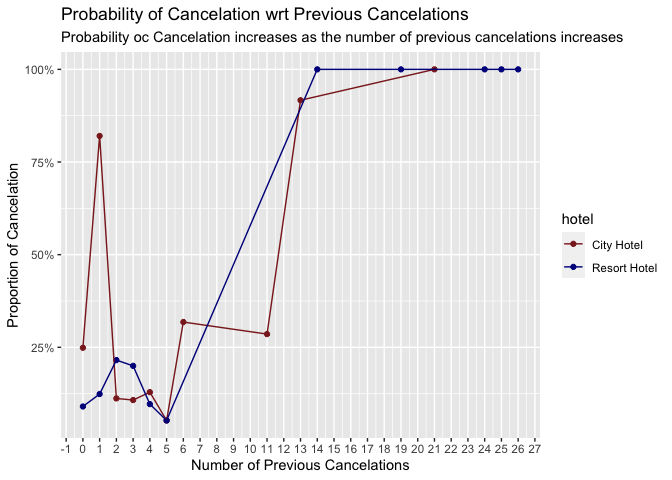<!-- -->

If a person has canceled once in the past, they are three times as
likely to cancel their booking.

``` r
bookings %>% 
  count(is_canceled, customer_type, sort = TRUE) %>% 
  group_by(customer_type) %>% 
  mutate(n = n / sum(n)) %>% 
  filter(is_canceled == "TRUE") %>% 
  ggplot(aes(fct_reorder(customer_type, n, .desc = TRUE), n)) +
  geom_col() +
  scale_y_continuous(
    labels = scales::label_percent(accuracy = 1)
  ) +
  labs(
    x = "Type of Booking",
    y = "Proportion of Cancelation",
    subtitle = "Transient customers are 30% more likely to cancel"
  )
```

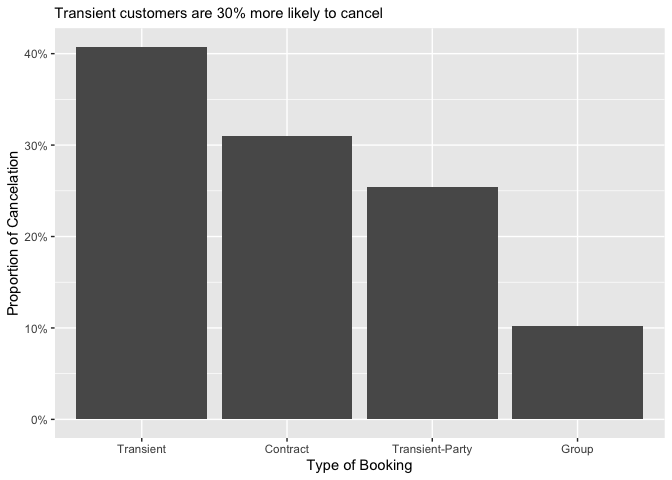<!-- -->

Here’s the definition of the four categories:

  - Contract - when the booking has an allotment or other type of
    contract associated to it;
  - Group – when the booking is associated to a group;
  - Transient – when the booking is not part of a group or contract, and
    is not associated to other transient booking;
  - Transient-party – when the booking is transient, but is associated
    to at least other transient booking

Transient customers are 30% more likely to cancel than groups.

# Part II: Modeling

After understanding the relationship between cancelation and different
variables above, we will use variables that had a correlation on
cancelation. For now, we’ll only focus on continuous variables.

So, far we have used all the entires in the data to conduct EDA. Our EDA
is not impacted by outliers because we used median instead of mean.
However, outliers have the ability to skew our model. Hence, we’ll focus
on 99% of the entries for the relevant variables.

``` r
# Parameter containing variables we want to truncate to their 99%
vars_to_truncate <- 
  c("lead_time", "stays_in_weekend_nights", "stays_in_week_nights", "adults", "children", "babies", "previous_cancellations", "booking_changes", "days_in_waiting_list")

# Parameter of variables to model on
vars_model <- 
  c("is_canceled", "lead_time", "stays_in_weekend_nights", "stays_in_week_nights", 
    "adults", "previous_cancellations", "booking_changes", "adr", "booking_changes", "arrival_date_day_of_month", "children", "deposit_type")


bookings_model <- 
  bookings %>% 
  filter_at(
    vars(!!! vars_to_truncate), 
    all_vars(. <= quantile(., probs = 0.99, na.rm = TRUE))
  ) %>% 
  mutate(
    deposit_type =
      recode(
        deposit_type,
        "No Deposit" = 0,
        "Non Refund" = 1,
        "Refundable" = 2
      )
  ) %>% 
  select(!!! vars_model)
```

Preparing the data.

``` r
# To split the data into training and test set respectively
bookings_split <- initial_split(bookings_model)
```

``` r
# The Recipe tarts a new set of transformations to be applied, similar to ggplot.
bookings_recipe <- 
  training(bookings_split) %>%
  recipe(is_canceled ~ .) %>% 
  step_corr(all_predictors()) %>% 
  step_center(all_predictors(), -all_outcomes()) %>% 
  step_scale(all_predictors(), -all_outcomes()) %>% 
  prep()

# We'll now transform the testing data using the above method
bookings_testing <- 
  bookings_recipe %>% 
  bake(testing(bookings_split))

# Load the prepared training data
bookings_training <- 
  juice(bookings_recipe)
```

Fitting the data

``` r
# Fitting Random Forest
bookings_ranger <- 
  rand_forest(trees = 100, mode = "classification") %>% 
  set_engine("ranger") %>% 
  fit(is_canceled ~ ., data = bookings_training)

# Predict the test data using the model above and add these predictions to the test dataset for comparison. And, validate the prediction

bookings_ranger %>% 
  predict(bookings_testing) %>% 
  bind_cols(bookings_testing) %>% 
  metrics(truth = is_canceled, estimate = .pred_class)
```

    ## # A tibble: 2 x 3
    ##   .metric  .estimator .estimate
    ##   <chr>    <chr>          <dbl>
    ## 1 accuracy binary         0.802
    ## 2 kap      binary         0.534

This result tells us that our model predicted cancelations with 81%
accuracy based on only a third of the available variables. Note, `kap`
refers to Kappa which is accuracy normalized by what would be expected
by chance alone. For more details on modeling, click
[here](https://rviews.rstudio.com/2019/06/19/a-gentle-intro-to-tidymodels/).

For comparison reason, let’s try a k nearest neighboors (KNN) model.

``` r
bookings_knn <- 
  nearest_neighbor(mode = "classification", neighbors = 10) %>% 
  fit(is_canceled ~ ., data = bookings_training)
```

    ## Warning: Engine set to `kknn`

``` r
bookings_knn %>% 
  predict(bookings_testing) %>% 
  bind_cols(bookings_testing) %>% 
  metrics(truth = is_canceled, estimate = .pred_class)
```

    ## # A tibble: 2 x 3
    ##   .metric  .estimator .estimate
    ##   <chr>    <chr>          <dbl>
    ## 1 accuracy binary         0.777
    ## 2 kap      binary         0.503

With the same number of variables, KNN results in a 78% accuracy. Hence,
we’ll prefer the random forest instead.

# Conclusion

A hotel manager can use our model to predict the probability of
cancelation with 81% accuracy. This is a valuable information to have
for a hotel manager. They can use this model to correctly estimate their
revenue and manage open rooms.
