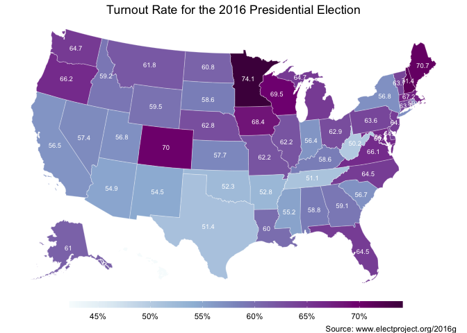
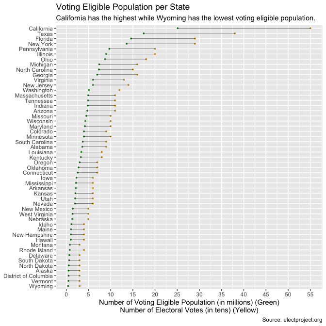
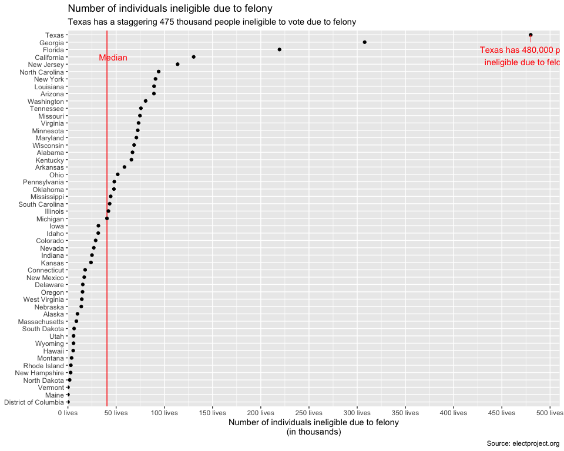
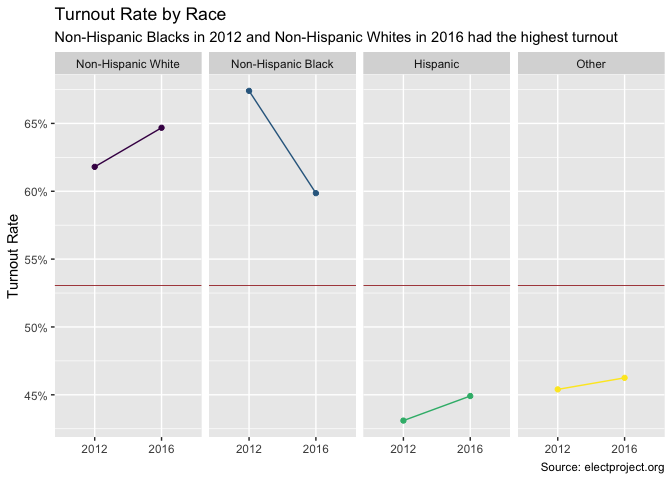
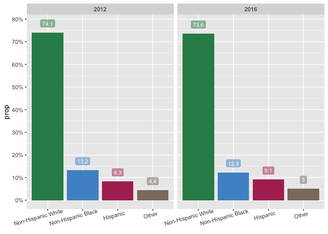
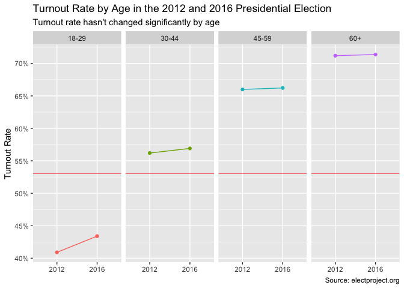
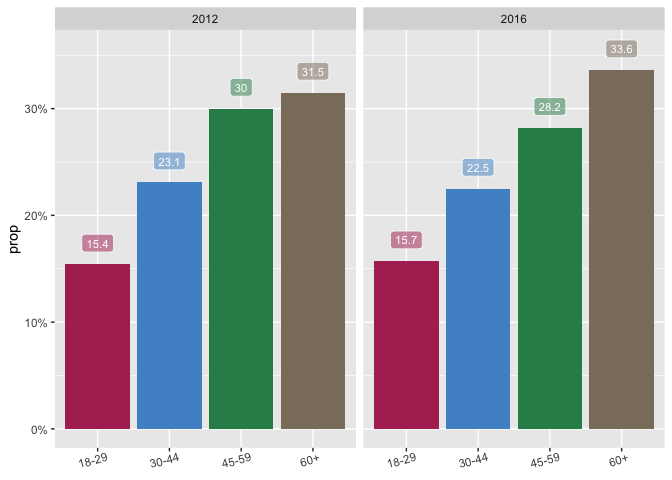
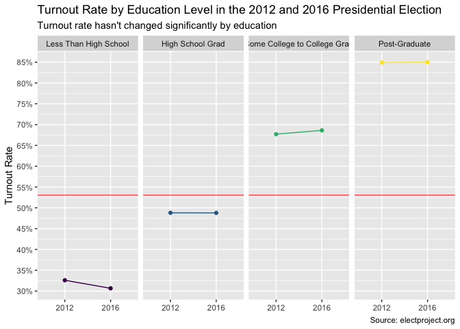

2012 - 2016 Presidential Election Voter Turnout Analysis
================
Tsion Tesfaye
2020-03-30

  - [Part 1: Voter Turnout by State](#part-1-voter-turnout-by-state)
      - [Overview](#overview)
      - [Wrangle](#wrangle)
          - [Read in The Data](#read-in-the-data)
          - [Exploratory Data Analysis](#exploratory-data-analysis)
          - [Turnout Rate by State](#turnout-rate-by-state)
  - [Part 2: Voter Turnout
    Demographics](#part-2-voter-turnout-demographics)
      - [Overview](#overview-1)
      - [Wrangle](#wrangle-1)
          - [Read in the data and
            cleanup](#read-in-the-data-and-cleanup)
          - [Exploratory Data Analysis
            (EDA)](#exploratory-data-analysis-eda)
  - [Key Conclusions](#key-conclusions)

``` r
# Libraries
library(tidyverse)
library(googlesheets4)
library(readxl)
library(sf)


# Parameters
  # Part I
  # 2016 Turnout Rate
input_turnout <- 
  "/Users/tsiontesfaye/Desktop/Classes/DCL/datasets/general_lection_turnout_rates_2016.csv"
  
  # Input Data Parameters
vars_type <- 
  cols_only(
    X1 = col_character(),
    `VEP Total Ballots Counted` = col_number(),
    `VEP Highest Office` = col_number(),
    `VAP Highest Office` = col_number(),
    `Total Ballots Counted (Estimate)` = col_number(),
    `Highest Office` = col_number(),
    `Voting-Eligible Population (VEP)` = col_number(),
    `Voting-Age Population (VAP)` = col_number(),
    `% Non-citizen` = col_number(),
    Prison = col_number(),
    Probation = col_number(),
    Parole = col_number(),
    `Total Ineligible Felon` = col_number()
  )

vars_rename <- 
  c(
    state = "X1",
    vep_total_counted = "VEP Total Ballots Counted",
    vep_highest_office = "VEP Highest Office",
    vap_highest_office = "VAP Highest Office",
    total_ballot_estimate = "Total Ballots Counted (Estimate)",
    highest_office = "Highest Office",
    voting_eligible_popn = "Voting-Eligible Population (VEP)",
    voting_age_popn = "Voting-Age Population (VAP)",
    non_citizen_perc = "% Non-citizen",
    prison = "Prison",
    probation = "Probation",
    parole = "Parole",
    ineligible_felon_total = "Total Ineligible Felon"
  )

  # Document containing the number of electoral votes assigned to each state
input_electoral_vote_num <- 
  "/Users/tsiontesfaye/portfolio_elections/data-raw/number_of_electoral_votes.xlsx"
  
  # Color gradient obtained using RColorBrewer::brewer.pal(9, "Purples")
map_colors <- RColorBrewer::brewer.pal(9, "BuPu")

  # Part II

  # Demographics of turnout url
input_demographics_url <- 
  "https://docs.google.com/spreadsheets/d/1l5fpK7ysQhQbZPv9hnZ_-PO1J1zBVPXSSQjNejTXecY/edit#gid=0"


#===============================================================================
# Code
  # Part I
electoral_vote_num <- 
  read_xlsx(input_electoral_vote_num)

  # Part II
id_survey <- as_sheets_id(input_demographics_url)
```

# Part 1: Voter Turnout by State

## Overview

Turnout rates per state are presented here. The preferred turnout rates
are those calculated with the voting-eligible population as the
denominator. The voting-eligible population (VEP) represents an estimate
of persons eligible to vote regardless of voter registration status in
an election and is constructed by modifying the voting-age population
(VAP), by components reported in the right-most columns (scroll right in
the spreadsheet). Links to data sources are provided at the bottom of
this page.

The preferred turnout rate numerator is the Total Ballots Counted, which
is all ballots election officials counted. Not all jurisdictions report
total ballots counted, so a second-best numerator is Highest Office,
which in a presidential election year is the total votes for all
presidential candidates including write-ins. Total ballots counted
includes blank and otherwise invalid votes for the highest office. Some
states may report a statistic they call total ballots cast, but is
actually vote for highest office. More information can be found
[here](http://www.electproject.org/2016g).

## Wrangle

### Read in The Data

Although we would like to plot the number of total ballots as the
percentage of voting eligible population, six states don’t report the
total ballot counted. Hence, we will be using the highest office votes
as a percentage of the voting eligible population as a close estimate.

``` r
turnout <- 
  read_csv(
    input_turnout, 
    skip = 1,
    col_types = vars_type
  ) %>% 
  rename(!!! vars_rename) %>% 
  slice(-c(1, n())) %>% #slice acts as select
  arrange(desc(vep_highest_office))
```

    ## Warning: Missing column names filled in: 'X1' [1]

### Exploratory Data Analysis

``` r
turnout %>% 
  summary()
```

    ##     state           vep_total_counted vep_highest_office vap_highest_office
    ##  Length:51          Min.   :43.20     Min.   :42.30      Min.   :38.30     
    ##  Class :character   1st Qu.:58.20     1st Qu.:56.80      1st Qu.:53.05     
    ##  Mode  :character   Median :61.50     Median :60.80      Median :56.80     
    ##                     Mean   :61.87     Mean   :60.75      Mean   :56.60     
    ##                     3rd Qu.:65.60     3rd Qu.:64.50      3rd Qu.:60.80     
    ##                     Max.   :74.70     Max.   :74.10      Max.   :69.40     
    ##                     NA's   :6                                              
    ##  total_ballot_estimate highest_office     voting_eligible_popn
    ##  Min.   :  258788      Min.   :  255849   Min.   :  429682    
    ##  1st Qu.:  755850      1st Qu.:  746112   1st Qu.: 1255264    
    ##  Median : 2049531      Median : 2001336   Median : 3282420    
    ##  Mean   : 2713961      Mean   : 2681450   Mean   : 4439419    
    ##  3rd Qu.: 3363440      3rd Qu.: 3321032   3rd Qu.: 5035524    
    ##  Max.   :14610509      Max.   :14181595   Max.   :25104844    
    ##  NA's   :6                                                    
    ##  voting_age_popn    non_citizen_perc     prison         probation     
    ##  Min.   :  446396   Min.   : 1.100   Min.   :     0   Min.   :     0  
    ##  1st Qu.: 1345181   1st Qu.: 2.800   1st Qu.:  6050   1st Qu.:     0  
    ##  Median : 3430652   Median : 4.700   Median : 18335   Median : 13489  
    ##  Mean   : 4903054   Mean   : 5.747   Mean   : 24854   Mean   : 42913  
    ##  3rd Qu.: 5567146   3rd Qu.: 8.100   3rd Qu.: 33156   3rd Qu.: 46473  
    ##  Max.   :30201571   Max.   :16.400   Max.   :155327   Max.   :410964  
    ##                                                                       
    ##      parole       ineligible_felon_total
    ##  Min.   :     0   Min.   :     0        
    ##  1st Qu.:     0   1st Qu.: 11880        
    ##  Median :  3379   Median : 40502        
    ##  Mean   :  8629   Mean   : 57944        
    ##  3rd Qu.: 10246   3rd Qu.: 72858        
    ##  Max.   :111287   Max.   :479956        
    ## 

As expected, there are 51 states. There are seven missing
`vep_total_counted` but, as indicated in the overview, some states don’t
report this number. Hence, we aren’t worried about these seven missing
values. All the other variables look normal and meet our expectation.

Let’s take a closer look at the individual variables.

### Turnout Rate by State

Add the state boundaries.

``` r
state_boundaries <- 
  ussf::boundaries(
    geography = "state",
    resolution = "20m",
    projection = "albers"
  )
```

Plot each state with its turnout rate in the 2016 election.

``` r
turnout %>%
  left_join(state_boundaries, by = c("state" = "NAME")) %>% 
  ggplot() +
  geom_sf(
    aes(fill = vep_highest_office, geometry = geometry),
    color = "white",
    size = 0.1
  ) +
  geom_sf_text(
    aes(label = vep_highest_office, geometry = geometry), 
    color = "white",
    size = 2.5
  ) +
  scale_fill_gradientn(
    colors = map_colors,
    na.value = "grey75",
    breaks = scales::breaks_width(5),
    labels = scales::label_percent(scale = 1, accuracy = 1)
  ) +
  guides(
    fill = guide_colorbar(barwidth = 25, barheight = 0.5, title = NULL)
  ) +
  theme_void() +
  theme(
    legend.position = "bottom",
    plot.title = element_text(hjust = 0.5)
  ) +
  labs(
    fill = "Turnout Percent per Voting Eligible Population",
    title = "Turnout Rate for the 2016 Presidential Election",
    caption = "Source: www.electproject.org/2016g"
  )
```

<!-- -->

Minnesota has the highest voter turnout rate at `74.1%` while Hawaii has
the lowest turnout rate at `42.3%`. The median turnout rate across all
states is 60.8.

``` r
turnout %>% 
  left_join(electoral_vote_num, by = c("state" = "state_name")) %>% 
  ggplot(aes(fct_reorder(state, voting_eligible_popn))) +
  geom_point(aes(y = voting_eligible_popn / 1e6), color = "forestgreen", size = 0.6) +
  geom_point(aes(y = number_of_electoral_votes), color = "goldenrod3", size = 0.6) +
  geom_segment(
    aes(xend = state, y = voting_eligible_popn / 1e6, yend = number_of_electoral_votes),
    size = 0.2,
    alpha = 0.9
    ) +
  scale_y_continuous(
    breaks = scales::breaks_width(5)
  ) +
  coord_flip() +
  labs(
    x = NULL,
    y = 
      "Number of Voting Eligible Population (in millions) (Green)\nNumber of Electoral Votes (in tens) (Yellow)",
    title = "Voting Eligible Population per State",
    subtitle = 
      "California has the highest while Wyoming has the lowest voting eligible population.",
    caption = "Source: electproject.org"
  ) 
```

<!-- -->

California (usually carried by Democrats) has the highest number of
voting eligible population at `25` million while Wayoming (usually
carried by Republicans) has the lowest at `0.5` million. The above plot
also explains how electoral votes are distributed amongst states -
states with higher voting eligible population have higher electoral
votes.

``` r
turnout %>% 
  ggplot(aes(fct_reorder(state, ineligible_felon_total), ineligible_felon_total)) +
  geom_hline(yintercept = median(turnout$ineligible_felon_total), color = "red") +
  geom_point() +
  coord_flip() +
  scale_y_continuous(
    labels = scales::label_number(scale = 1e-3, suffix = " lives"),
    breaks = scales::breaks_width(0.5e5),
    expand = expansion(add = c(0e5, .3e5))
  ) +
  annotate(
    "text",
    x = c("California", "Florida"),
    y = c(47000, 480000),
    label = c("Median", "↑\nTexas has 480,000 people\nineligible due to felonies"),
    color = "red"
  ) +
  labs(
    x = NULL,
    y = "Number of individuals ineligible due to felony\n(in thousands)",
    title = "Number of individuals ineligible due to felony",
    subtitle = 
      "Texas has a staggering 475 thousand people ineligible to vote due to felony",
    caption = "Source: electproject.org"
  )
```

<!-- -->

This plot is saddening. Texas, Georgia, and Florida (all states carried
by a republican in 2016) prevent a total of one million people from
voting due to felonies.

# Part 2: Voter Turnout Demographics

## Overview

As indicated above, analyzing voter turout per state indicated the
percentage of voting eligible population who voted in the 2016
presidential election. However, this analysis doesn’t show the
demographics of the voters.

Census Bureau’s Current Population Survey (aka CPS) is a widely used
tool to understand voter demographics. The CPS is a large survey
primarily used to calculate the nation’s unemployment rate. Note that
CPS samples households randomly and excludes military barracks, dorms
and prisons. In the November of an election year the Census Bureau asks
a limited number of questions about voting and registration. When
cross-tabulated with the survey’s extensive demographics, the CPS
provides a comprehensive snapshot of participation among various
demographic groups.

Note that election related suverys are prone to two main errors: random
sampling and over reporting. It has been shown that people usually
over-report their likelihood to vote. This dataset corrects for both
errors. To learn more about the process, [click
here](http://www.electproject.org/home/voter-turnout/cps-methodology).

## Wrangle

### Read in the data and cleanup

Since the Google Spreadsheet has three sheets (Race and Ethnicity, Age,
and Education). Since each of these sheets needs to be read in a similar
fashion, we’ll write a function to read a sheet. We’ll also write a
function to plot the data.

``` r
# Function to read in a googlesheet

read_turnout_rate <- function(sheet_name){
  read_sheet(id_survey, sheet = sheet_name) %>% 
    select(
      "weight" = `Census Weight for Vote Overreport Bias Correction`, 
      "prop_2016" = ...3,
      "prop_2012" = ...5
    ) %>% 
    drop_na(weight) %>% 
    mutate(
      "remove" = if_else(!is.na(prop_2016), NA_character_, weight)
    ) %>% 
    fill(remove) %>% 
    filter(is.na(remove)) %>% 
    select(-remove) %>% 
    mutate(
      "category" = if_else(prop_2016 == 2016.0000, weight, NA_character_)
    ) %>% 
    fill(category) %>% 
    pivot_wider(
      names_from = category,
      values_from = c(weight, prop_2016, prop_2012)
    ) %>% 
    unnest() %>% 
    select(
      {{sheet_name}} := `weight_Turnout Rate`,
      turnout_rate_2012 = `prop_2012_Turnout Rate`,
      turnout_rate_2016 = `prop_2016_Turnout Rate`
    ) %>%
    pivot_longer(
      cols = -c(sheet_name),
      names_to = c("category", "year"),
      names_pattern = "(^.+_)(\\d{4}$)",
      values_to = "turnout_rate"
    ) %>% 
    filter(!turnout_rate %in% c(2016.0000, 2012.0000)) %>% 
    select(-category) %>% 
    rename_all(str_to_lower)
}
```

``` r
turnout_by_race <- read_turnout_rate("Race and Ethnicity")

turnout_by_age <- read_turnout_rate("Age")

turnout_by_education <- read_turnout_rate("Education")
```

### Exploratory Data Analysis (EDA)

``` r
# Plotting order of races
plotting_order <- 
  c("Non-Hispanic White", "Non-Hispanic Black", "Hispanic", "Other")


turnout_by_race %>% 
  rename("race" = `race and ethnicity`) %>% 
  mutate(
    race = ordered(race, levels = plotting_order)
  ) %>% 
  ggplot(aes(year, turnout_rate, color = race, group = race)) +
  geom_hline(
    yintercept = median(turnout_by_race$turnout_rate), 
    color = "brown",
    size = 0.3
  ) +
  geom_point(show.legend = FALSE) +
  geom_line(show.legend = FALSE) +
  scale_y_continuous(
    labels = scales::label_percent(accuracy = 1),
    breaks = scales::breaks_width(.05)
  ) +
  facet_grid(cols = vars(race)) +
  labs(
    x = NULL,
    y = "Turnout Rate",
    title = "Turnout Rate by Race",
    subtitle = 
      "Non-Hispanic Blacks in 2012 and Non-Hispanic Whites in 2016 had the highest turnout",
    caption = "Source: electproject.org"
  )
```

<!-- -->

This plot clearly demonstrates that Non-Hispanic Blacks had the highest
turnout rate at `67%` in 2012. But this rate declined to `60%` in 2016
while the Non-Hispanic White turnout rate increased from `63%` to `65%`
in 2016. Unfortunatley, both Others and Hispanics have a below median
turnout rate although each seem to have increased slightly in 2016.
Let’s see what percent of the electorate each of these racial groups
account for.

``` r
share_of_electorate_per_race <- 
  tribble(
    ~race,                  ~"2012",         ~"2016",
    "Non-Hispanic Black",    13.2,                12.3,
    "Non-Hispanic White",    74.1,                73.6,
    "Other",                 4.4,                 5.0,
    "Hispanic",              8.3,                 9.1
  )
```

``` r
share_of_electorate_per_race %>% 
  pivot_longer(
    cols = -race,
    names_to = "years",
    values_to = "prop"
  ) %>% 
  ggplot(aes(fct_reorder(race, prop, .desc = TRUE), prop, fill = race)) +
  geom_col(show.legend = FALSE) +
  geom_label(
    aes(x = race, y = prop + 4, label = prop),
    size = 3,
    color = "white",
    alpha = 0.5,
    show.legend = FALSE
  ) +
  scale_y_continuous(
    breaks = scales::breaks_width(10),
    labels = scales::label_percent(scale = 1, accuracy = 1)
  ) +
  scale_fill_manual(values = c("maroon", "steelblue3", "seagreen4", "bisque4")) +
  facet_wrap(vars(years)) +
  theme(axis.text.x = element_text(angle = 15, hjust = 0.7)) +
  labs(
    x = NULL
  )
```

<!-- -->

Non Hispanic Whites account for `74.1%` of the electorate but only 65%
of them turnout to vote in 2016. Non Hispanic Blacks account for only
`13.5%` of the electroate but about `60%` of them showed up to vote in
2016. Although this turnout rate could still be improved, it can be
argued that the non-hispanic black turnout rate is better than the
non-hispanic white turnout rate.

``` r
turnout_by_age %>%
  ggplot(aes(year, turnout_rate, color = age, group = age)) +
  geom_hline(
    yintercept = median(turnout_by_race$turnout_rate), 
    color = "red",
    size = 0.3
  ) +
  geom_point(show.legend = FALSE) +
  geom_line(show.legend = FALSE) +
  scale_y_continuous(
    labels = scales::label_percent(accuracy = 1),
    breaks = scales::breaks_width(.05)
  ) +
  facet_grid(cols = vars(age)) +
  labs(
    x = NULL,
    y = "Turnout Rate",
    title = "Turnout Rate by Age in the 2012 and 2016 Presidential Election",
    subtitle = "Turnout rate hasn't changed significantly by age",
    caption = "Source: electproject.org"
  )
```

<!-- -->

The above plot demonstrates that there wasn’t a significant shift in
voter turnout by age between the 2012 and 2016 elections although there
is a slight increase in the 18-29 category.

``` r
share_of_electorate_per_age <- 
  tribble(
    ~"age",       ~ "2012",         ~"2016",
    "18-29",       15.4,             15.7,
    "30-44",       23.1,             22.5,
    "45-59",       30.0,             28.2,
    "60+",         31.5,             33.6
  )
```

``` r
share_of_electorate_per_age %>% 
  pivot_longer(
    cols = -age,
    names_to = "years",
    values_to = "prop"
  ) %>% 
  ggplot(aes(age, prop, fill = age)) +
  geom_col(show.legend = FALSE) +
  geom_label(
    aes(x = age, y = prop + 2, label = prop),
    size = 3,
    color = "white",
    alpha = 0.5,
    show.legend = FALSE
  ) +
  scale_y_continuous(
    breaks = scales::breaks_width(10),
    labels = scales::label_percent(scale = 1, accuracy = 1)
  ) +
  scale_fill_manual(values = c("maroon", "steelblue3", "seagreen4", "bisque4")) +
  facet_wrap(vars(years)) +
  theme(axis.text.x = element_text(angle = 15, hjust = 0.7)) +
  labs(
    x = NULL
  )
```

<!-- -->

Voters between the ages of 18 and 44 accounted for 40% of the electorate
in general but their average turnout rate was only `50%`. This indicates
a great campaign potential for candidates.

``` r
education_order <- 
  c("Less Than High School", "High School Grad", "Some College to College Grad", "Post-Graduate")

turnout_by_education %>% 
  mutate(
    education = ordered(education, level = education_order)
  ) %>% 
  ggplot(aes(year, turnout_rate, color = education, group = education)) +
  geom_hline(
    yintercept = median(turnout_by_race$turnout_rate), 
    color = "red",
    size = 0.3
  ) +
  geom_point(show.legend = FALSE) +
  geom_line(show.legend = FALSE) +
  scale_y_continuous(
    labels = scales::label_percent(accuracy = 1),
    breaks = scales::breaks_width(.05)
  ) +
  facet_grid(cols = vars(education)) +
  labs(
    x = NULL,
    y = "Turnout Rate",
    title = "Turnout Rate by Education Level in the 2012 and 2016 Presidential Election",
    subtitle = "Turnout rate hasn't changed significantly by education",
    caption = "Source: electproject.org"
  )
```

<!-- -->

The above plot indicates that there was not a significant shift in
percentage of turnout by education level. Note that although `85%` of
post graduates turn out to vote, they account only about `13%` of the
total electorate. Some college and College Grads account for roughly
`55%` of the electorate while High School Grads account for about `25%`
of the electorate.

The above three plots imply that, holding age and education constant,
race is the most determinant factor of turnout. Non Hispanic Blacks and
Non Hispanic Whites rank above the median (although they are still
around the 65% mark) while Hispanics and Others fall short of the
median. Hence, campaign and mobilization efforts can be directed towards
increasing turnout amongst high school graduates and Hispanics.

# Key Conclusions

  - Nationwide, the median turnout rate is only 60.8% with Minnesota
    having the highest turnout rate at `74.1`%.
  - The number of electoral votes assiged to each state is roughly
    proportional to the number of voting eligible population.
      - California, Texas, Florida, and New York have the top four
        highest number of voting eligible people and electoral votes.
  - Texas has the highest number of people who are ineligible to vote
    due to felonies (either currently in prison or on parole). This
    number is a staggering `480,000`.
  - In 2012, blacks had the highest turnout rate at `67`%. However, this
    rate declined to only `60%` in 2016 while the white turnout rate
    increased to `65%`.
      - It is important to note that whites account for `73`% of the
        electoral vote. Hence, `65%` turnout rate can be considered low.
  - Voters between the ages of 18 and 44 accounted for 40% of the
    electorate in general but their average turnout rate is only `50%`.
  - There wasn’t a significant shift in the turnout rate based on
    education level.

Overall, this analysis indicates a clear need for increased turnout
amongst all races and especially amongst youth. Also, it is recommended
for policy makers to take a closer look at the alarming number of people
in Texas who are excluded from voting due to felonies.
